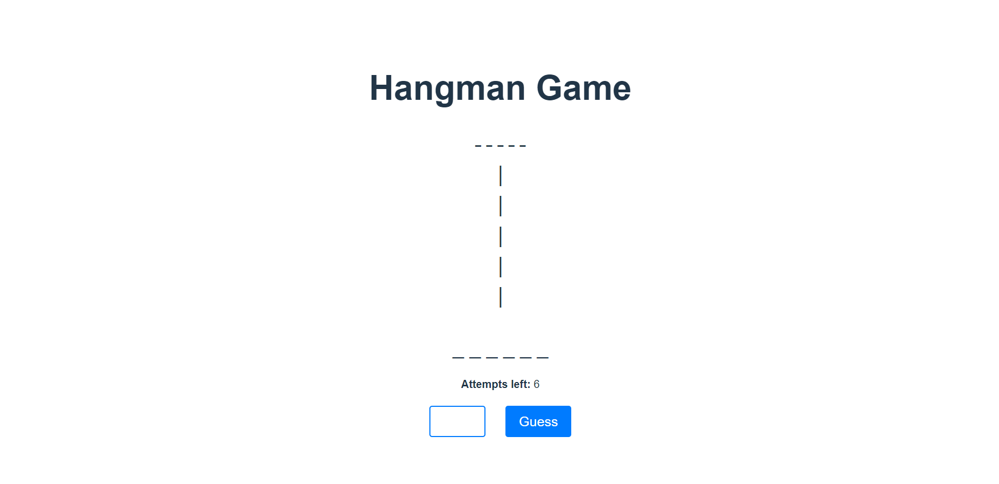

# Hangman Game 🎮



Welcome to the **Hangman Game**, a modern take on the classic word-guessing challenge! This project is built using **React** and **Vite** and offers a simple, interactive UI where users can guess letters to reveal a hidden word before the hangman drawing is complete.

### 🔥 [Play the Game](https://vortex-m.github.io/hangman-game) 🔥

---

## 🚀 Features:
- **Interactive Gameplay**: Guess one letter at a time to complete the word.
- **Dynamic Hangman Drawing**: Visual feedback for correct and incorrect guesses.
- **Restart Game Functionality**: Play as many rounds as you want.
- **Responsive Design**: Optimized for various screen sizes.
- **Easy to Use**: Clean and intuitive UI.

---

## 🛠️ Tech Stack:
- **React**: Front-end library for creating dynamic UI components.
- **Vite**: Fast build tool for modern web projects.
- **Axios**: For making HTTP requests to the backend.
- **GitHub Pages**: Hosting the game for free.

---

## 🕹️ How to Play:
1. Enter a letter in the input field and press 'Guess' or hit the 'Enter' key.
2. Watch the hangman drawing update based on your guess.
3. Keep guessing letters until you complete the word or run out of attempts.
4. Restart the game anytime with the 'Restart Game' button.

---

## 📦 Installation

If you want to run the game locally:

1. Clone the repository:
   ```bash
   git clone https://github.com/vortex-m/hangman-game.git
